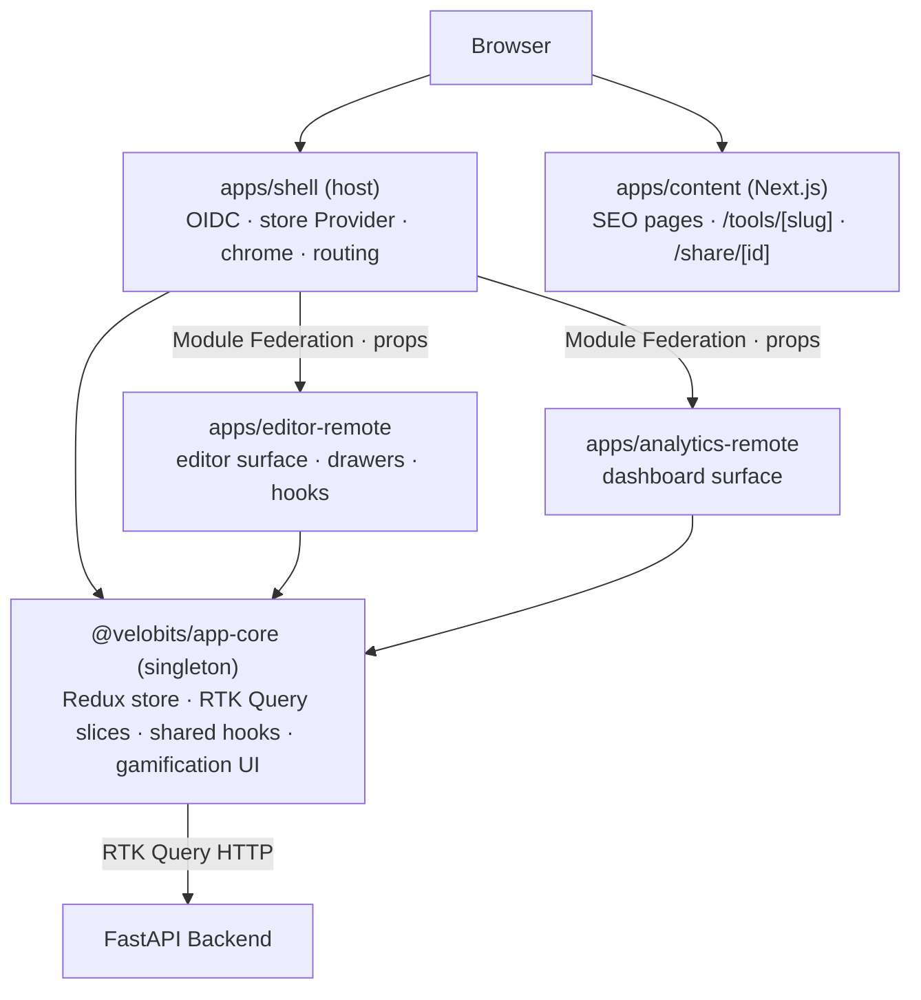

# Frontend Architecture

> System overview of the FixMyText micro-frontend monorepo.

## Overview

The frontend is a **micro-frontend (MFE)** monorepo composed of a Module Federation host, two independently-deployed remotes, a Next.js content app, and shared workspace packages. All 254 tools are data-driven — no per-tool components or conditionals in routing.

## App Topology

```
Browser
  └── apps/shell  (host, /app/*)
        ├── Redux store + OIDC auth (from @velobits/app-core — federation singleton)
        ├── Context providers (Alert, App, Theme) → inject props to remotes
        ├── apps/editor-remote  (remote, loaded at /app/ and /app/editor/*)
        │     └── owns: editor surface, drawers, 18 editor hooks, CommandPalette
        └── apps/analytics-remote  (remote, loaded at /app/dashboard)
              └── owns: dashboard page, 7 dashboard section components
```

The shell is the **only** Module Federation host — it provides the Redux store, RTK Query API instances, and OIDC auth to remotes via:
1. `@velobits/app-core` declared as a federation singleton (deduplicated at runtime)
2. Explicit prop injection (`mode`, `setMode`, `showAlert`, `gamification`, `user`, `isAuthenticated`, `subscription`) passed to each remote's exposed component

## Dev Ports

| App | Package | Port (Docker/nginx) | Port (host vite) |
|-----|---------|---------------------|------------------|
| shell | `@velobits/shell` | 3000 | 3000 |
| editor-remote | `@velobits/editor-remote` | 3101 | 3101 |
| analytics-remote | `@velobits/analytics-remote` | 3102 | 3102 |
| content | `@velobits/content-app` | 3103 (nginx) | 3001 |

> Note: `apps/content` runs on port 3001 locally but is served via nginx on port 3103 in the Docker Compose stack. This is intentional — nginx handles the path-based routing at 3000.

## Layer Diagram



## Source Ownership

| Surface | Owned by | Shared via |
|---------|----------|------------|
| Editor page + drawers + editor hooks | `apps/editor-remote/src/` | — |
| Dashboard page + sections | `apps/analytics-remote/src/` | — |
| Auth, layout chrome, About/Pricing pages, SharePage | `apps/shell/src/` | — |
| Redux store, RTK Query APIs, gamification UI, shared data hooks | `packages/app-core/src/` | federation singleton |
| OIDC / Keycloak integration | `packages/app-core/src/auth/` (userManager, useOidcAuth, AuthCallback, SilentCallback) | injected as props |
| Context providers (Alert, App, Theme) | `apps/shell/src/contexts/` | injected as props |

## `@velobits/app-core` — Federation Singleton

`app-core` is declared `{ singleton: true }` in **all three** Vite federation configs (shell host + both remotes). This ensures exactly one copy of the Redux store and RTK Query API instances exists at runtime — remotes' hooks dispatch to shell's store, and queries cache correctly.

### RTK Query Slices

| Slice | Reducer path | Purpose |
|-------|-------------|---------|
| `textApi` | `textApi` | `transformText` mutation used by every text tool |
| `authApi` | `authApi` | Login, register, refresh, logout, current-user |
| `userDataApi` | `userDataApi` | Profile, gamification stats, user settings |
| `historyApi` | `historyApi` | Operation history — paginated fetch + delete |
| `subscriptionApi` | `subscriptionApi` | Razorpay order creation, subscription tier |
| `passesApi` | `passesApi` | Prepaid pass purchase and balance |
| `shareApi` | `shareApi` | Create/retrieve shareable link |

`authSlice` (non-API) stores only the current `user` (populated from `authApi.getMe`); it does **not** hold tokens. OIDC tokens (incl. the refresh token) live **only in memory** via `oidc-client-ts` (`packages/app-core/src/auth/userManager.ts`, H-8) — never in `localStorage`/`sessionStorage`. On a hard reload the session is re-hydrated by a silent renew against the Keycloak SSO cookie. The PKCE state store remains in `localStorage` because it must survive the full-page redirect to Keycloak.

## Cross-Tab Auth Sync

Login/logout events are propagated across same-origin tabs via a `BroadcastChannel` (`fixmytext_auth`) declared at module scope in `userManager.ts`:

- `AuthCallback` broadcasts `{ type: 'user_loaded' }` after `signinRedirectCallback()`; other tabs respond with a `signinSilent()` so they pick up the session without a refresh.
- `useOidcAuth.logout()` broadcasts `{ type: 'user_signed_out' }`; other tabs call `removeUser()` to drop the in-memory user immediately.

The channel listener is registered once at module scope (not per hook instance), so each event is handled exactly once regardless of how many `useOidcAuth` consumers are mounted.

## Context Providers (shell)

Composed in `apps/shell/src/App.tsx` (outermost first):

| Provider | Exposes |
|----------|---------|
| `ThemeProvider` | dark/light mode + toggle, persisted to `localStorage` |
| `AlertProvider` | `showAlert` / `dismissAlert` — toast notifications |
| `AppProvider` | Aggregates `useAuth`, `useGamification`, `useSubscription` → injected to remotes as props |

## Shell Routes (`/app` basename)

| Route | Component | Auth |
|-------|-----------|------|
| `/` | Home (editor-remote) | No |
| `/login` | LoginPage | No |
| `/signup` | SignupPage | No |
| `/forgot-password` | ForgotPasswordPage | No |
| `/dashboard` | DashboardPage (analytics-remote) | Yes |
| `/about` | AboutPage | No |
| `/pricing` | PricingPage | No |
| `/auth/callback` | AuthCallback | No |
| `/auth/silent-callback` | SilentCallback | No |
| `/share/:id` | SharePage | No |

## Tool Data-Flow

Every text tool follows the same path from definition to backend call:

```
packages/app-core/src/constants/tools.ts   — tool definition (re-exported from @velobits/tools-registry)
        ↓
useTransformTextMutation (editor-remote)   — RTK Query hook generated by textApi
        ↓
textApi RTK slice (app-core)               — POST to tool.endpoint with { text, …params }
                                             injects X-Visitor-Id header (baseQuery)
        ↓
FastAPI backend                            — /api/v1/text/{slug}
        ↓
TextResponse { original, result, operation }
        ↓
useTransformTextMutation                   — returns result to TextForm in editor-remote
```

## Build Pipeline

| Item | Detail |
|------|--------|
| Bundler | Vite 8 (all apps) |
| Federation | `@module-federation/vite` |
| Shell entry | `apps/shell/src/index.tsx` |
| Remote entries | `apps/*/src/index.ts` (each exposes one component) |
| Shared singletons | react, react-dom, react-router-dom, @reduxjs/toolkit, react-redux, @sentry/react, @velobits/app-core |
| Manual chunks (shell) | `vendor-export` (jsPDF, docx), `vendor-format` (Prettier), `vendor-hash` (crypto libs) |
| Content bundler | Next.js 15 App Router |
