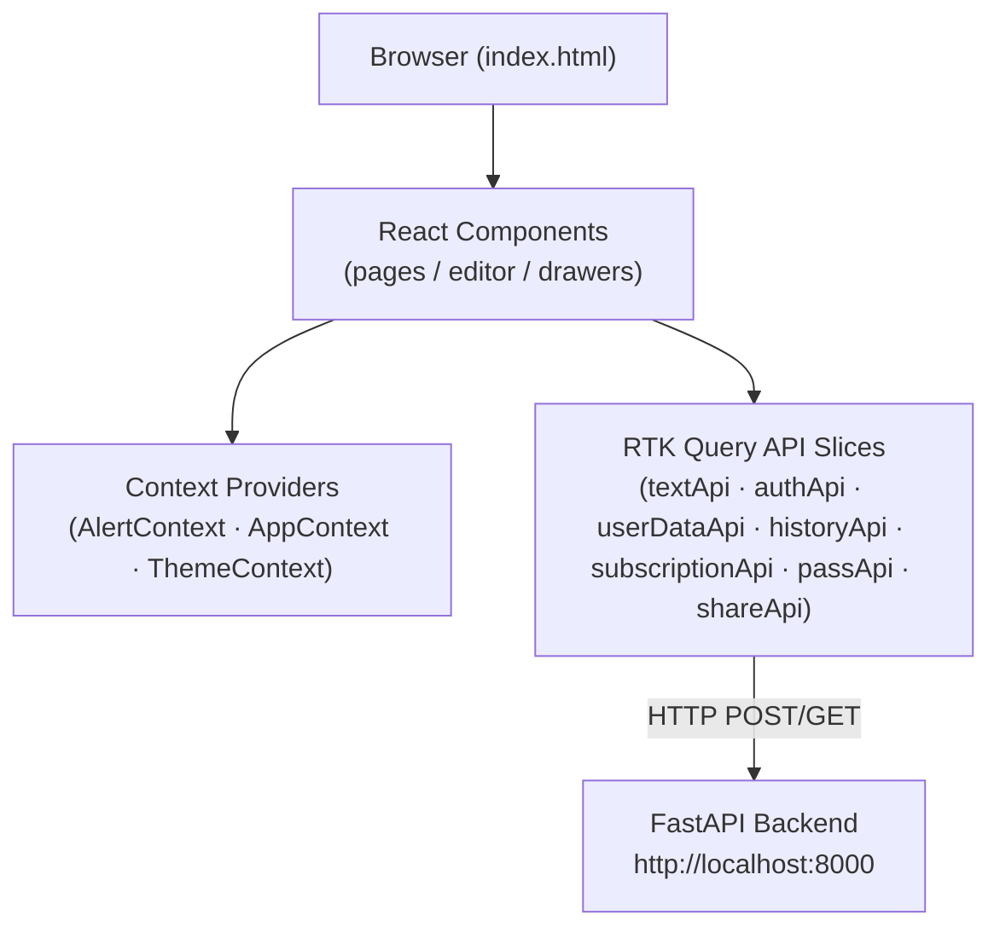

# Frontend Architecture

> System overview of the FixMyText React + Vite frontend.

## Overview

The frontend is a single-page application built with React 18 and bundled by Vite 6. It communicates with the FastAPI backend exclusively through RTK Query API slices. All 254 tools are data-driven — no per-tool components or conditionals in routing.

## Layer Diagram



## Context Providers

The three React context providers are composed in `src/App.jsx` in this order (outermost first):

| Provider | File | What it exposes |
|----------|------|----------------|
| `ThemeProvider` | `src/contexts/ThemeContext.jsx` | Dark/light mode state and toggle, backed by `useTheme` and persisted to `localStorage` |
| `AlertProvider` | `src/contexts/AlertContext.jsx` | `showAlert` / `dismissAlert` methods backed by `useAlert`; surfaces toast notifications app-wide |
| `AppProvider` | `src/contexts/AppContext.jsx` | Aggregates `useAuth` (user, isAuthenticated), `useGamification` (XP, streaks, achievements), and `useSubscription` (billing tier, passes) into a single memoized value |

Components consume these via the matching `use*Context()` hooks exported from each file.

## RTK Query Slices

All network I/O goes through RTK Query. Slices live in `src/store/api/`:

| File | Reducer path | Purpose |
|------|-------------|---------|
| `baseQuery.js` | — | Shared base query with JWT auto-refresh (mutex-protected) and `X-Visitor-Id` header injection |
| `textApi.js` | `textApi` | Single `transformText` mutation used by every text tool |
| `authApi.js` | `authApi` | Login, register, refresh, logout, current-user (`/api/v1/auth/`) |
| `userDataApi.js` | `userDataApi` | Profile, gamification stats, user settings (`/api/v1/user-data/`) |
| `historyApi.js` | `historyApi` | Operation history — fetch paginated list, delete entry (`/api/v1/history/`) |
| `subscriptionApi.js` | `subscriptionApi` | Razorpay order creation, webhook status, subscription tier (`/api/v1/subscription/`) |
| `passApi.js` | `passApi` | Prepaid pass purchase and balance (`/api/v1/passes/`) |
| `shareApi.js` | `shareApi` | Create shareable link, retrieve shared result (`/api/v1/share/`) |

Redux state slices (non-API) live in `src/store/slices/`:

| Slice | Purpose |
|-------|---------|
| `authSlice` | Stores `access_token` and user info; persisted to `localStorage` |

Error middleware in `src/store/middleware/` intercepts RTK Query rejected actions and dispatches `showAlert` calls automatically.

## Tool Data-Flow

Every text tool follows the same path from definition to backend call:

```
src/constants/tools.js          — static tool definition (id, type, endpoint, …)
        ↓
useTransformText hook           — wraps useTransformTextMutation from textApi
        ↓
textApi RTK slice               — POST to tool.endpoint with { text, …params }
                                  injects X-Visitor-Id header
        ↓
FastAPI backend                 — /api/v1/text/{slug}
        ↓
TextResponse { original, result, operation }
        ↓
useTransformText                — returns result to the editor component
```

The `endpoint` field in each tool definition uses a named constant from `src/constants/endpoints.js` (e.g., `ENDPOINTS.REVERSE_WORDS`), which resolves to the exact URL path registered in the backend router.

## Build Pipeline

| Item | Detail |
|------|--------|
| Bundler | Vite 6.2 |
| Entry point | `index.html` → `src/index.jsx` |
| Output directory | `dist/` |
| Dev server port | 3000 (with HMR) |
| Plugin | `@vitejs/plugin-react` (Babel-based Fast Refresh) |
| Manual chunks | `vendor-export` (jsPDF, docx), `vendor-format` (Prettier), `vendor-hash` (crypto libraries) |

The manual chunk split keeps the main bundle lean by isolating heavy export and hashing libraries into separate lazily-loaded chunks.
